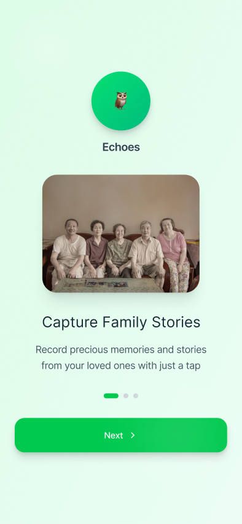
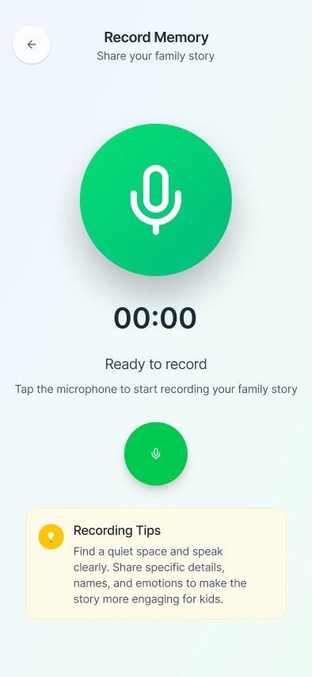
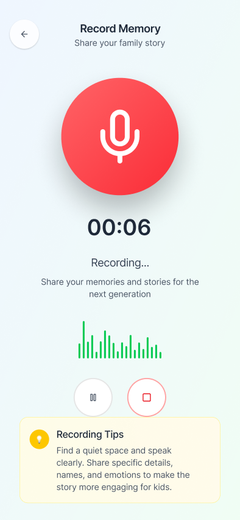
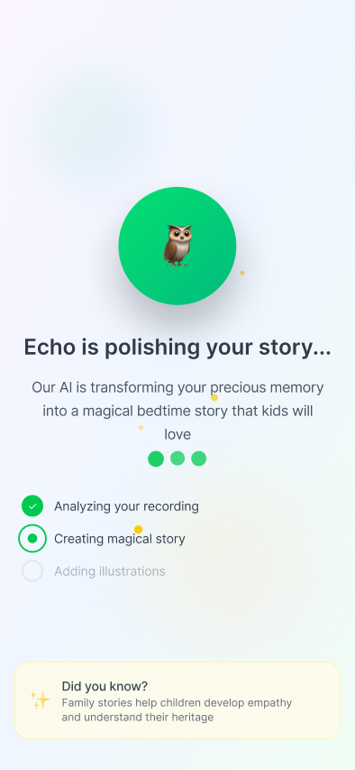
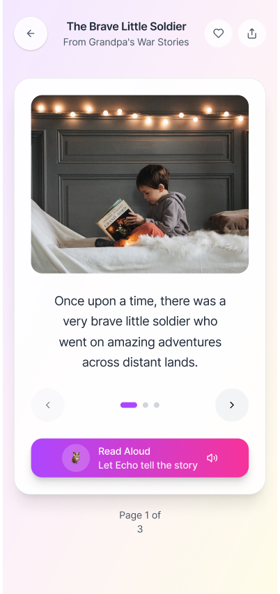

# 🎯 Echoes - Turn Conversations into Timeless Family Stories

[](https://flutter.dev)
[](https://fastapi.tiangolo.com)
[](https://github.com)

**🚀 ACTA Global Hackathon 2025 Submission**

> Preserving intergenerational knowledge by making it simple and delightful for grandparents to share life stories and for families to consume them as both archive posts and bedtime stories.

## 📱 App Preview

### Onboarding Experience
<div align="center">



</div>

### Main App Flow
<div align="center">



</div>

### Story Processing & Reading
<div align="center">


</div>

## 🌟 What is Echoes?

Echoes is an AI-powered mobile app that transforms grandparents' spoken memories into magical bedtime stories for children. Built with Flutter and powered by advanced AI technologies, it bridges generations through the timeless art of storytelling.

### ✨ Key Features

- **🎙️ Voice Recording**: Simple, accessible interface for grandparents to record their memories
- **🤖 AI Story Generation**: Uses Google Gemini to transform memories into engaging children's stories
- **📖 Interactive Story Reading**: Children's book-style carousel with page-by-page navigation
- **🔊 Text-to-Speech**: AI-generated narration brings stories to life
- **🎨 Gamified Experience**: Duolingo-inspired design with delightful animations and interactions

### 🎯 The Problem We Solve

Family stories and wisdom often get lost between generations. Echoes makes it effortless for grandparents to preserve their memories while creating magical content that children actually want to engage with.

### 👥 Who It's For

- **👴👵 Grandparents**: Easy, voice-first way to share life stories
- **👨‍👩‍👧‍👦 Parents**: Meaningful bedtime content derived from family history
- **👶 Children**: Magical, personalized stories about their family heritage

## 🛠️ Technology Stack

### Frontend (Flutter)
- **🎨 UI Framework**: Flutter with custom animations and transitions
- **🧭 Navigation**: GoRouter for seamless navigation flow
- **📱 State Management**: Provider pattern for reactive UI updates
- **🎵 Audio**: FlutterSound for recording and playback

### Backend (FastAPI)
- **🚀 API**: FastAPI with async/await for high performance
- **🎙️ Speech-to-Text**: Deepgram for accurate transcription
- **🤖 AI Story Generation**: Google Gemini for creative storytelling
- **🔊 Text-to-Speech**: Deepgram TTS for natural narration
- **☁️ Deployment**: Render.com for reliable cloud hosting

### AI & Processing
- **📝 STT**: Deepgram Nova-3 model for speech recognition
- **✍️ Story Generation**: Google Gemini 2.0 Flash for creative writing
- **🗣️ TTS**: Deepgram Aura voices for natural speech synthesis

## 🚀 Quick Start

### Prerequisites
- Flutter SDK (>=3.0.0)
- Python 3.8+
- Deepgram API Key
- Google Gemini API Key

### Frontend Setup
```bash
cd workspace
flutter pub get
flutter run
```

### Backend Setup
```bash
cd workspace/backend
pip install -r requirements.txt

# Create .env file with your API keys
echo "DEEPGRAM_API_KEY=your_key_here" > .env
echo "GOOGLE_GEMINI_API_KEY=your_key_here" >> .env

# Run the server
python main.py
```

## 🎬 How It Works

1. **📱 Record Memory**: Grandparent records a personal story or memory
2. **🤖 AI Processing**: 
   - Speech-to-Text converts audio to text
   - Google Gemini transforms memory into a children's story
   - Text-to-Speech creates narration audio
3. **📖 Story Experience**: Child enjoys the story in an interactive book format
4. **💝 Family Archive**: Stories are preserved for future generations

## 🏆 Hackathon Achievements

Built in 24 hours for the ACTA Global Hackathon 2025, focusing on:

- **🎨 Craft**: Polished Flutter UI with smooth animations and responsive design
- **💡 Novelty**: Unique combination of memory preservation and children's storytelling
- **🛠️ Utility**: Solves real problem of intergenerational knowledge transfer
- **✨ Taste**: Warm, playful design inspired by modern mobile apps

## 🔗 Live Demo

**Backend API**: [https://echoes-backend.onrender.com](https://echoes-backend.onrender.com)

API Documentation: [https://echoes-backend.onrender.com/docs](https://echoes-backend.onrender.com/docs)

## 📱 Installation

Download the app and experience the magic of turning family memories into bedtime stories.

*Note: This is a hackathon prototype. Future versions will include user accounts, story sharing, and enhanced AI capabilities.*

---

## 🏅 Original Hackathon Information

---

## 🏅 Original Hackathon Information

**ACTA Global Hackathon 2025 - 24 hours to build something impressive.**

## ⏰ Timeline

- **Start**: Oct 4, 2025 at 12:00 CET
- **End**: Oct 5, 2025 at 12:00 CET
- **Duration**: 24 hours

## 🏆 Prizes

1. **1st**: One week in Cape Town (flights + hotel)
2. **2nd**: €300 + fast-tracked interview
3. **3rd**: Raspberry Pi + fast-tracked interview

## 💡 Problem Statement

**Memory Keeper for Grandparents**: Interactive AI conversations that capture grandparents' life memories and turn them into blog posts for family members. Think Duolingo but for preserving family stories and wisdom.

## � Judging Criteria

**Top 25 submissions** ranked 1-10 on each criterion:

### Craft (1-10)
Quality of execution, code quality, attention to detail, polish. Does it work smoothly? Is it well-built?

### Novelty (1-10)
Originality and innovation. Is this a fresh take? Does it approach the problem differently?

### Utility (1-10)
Practical usefulness and real-world value. Would people actually use this? Does it solve a genuine problem?

### Taste (1-10)
Design sensibility, user experience, aesthetic choices. Is it intuitive? Does it feel good to use?

## 📤 Submission Details

**Submitted at**: [https://forms.acta.so/r/wMobdM](https://forms.acta.so/r/wMobdM)

- ✅ Public GitHub repo
- ✅ 60-second demo video
- ✅ Live demo URL
- ✅ 5+ commits during hackathon
- ✅ Updated README with project info

## 📞 Support

- **Discord**: [Join](https://discord.gg/9KbH3f5M2a)
- **Instagram**: [@acta.so](https://instagram.com/acta.so)
- **Web**: [acta.so/hackathon](https://www.acta.so/hackathon)

---

**Built with ❤️ in 24 hours | Good luck to all participants! 🎉**
