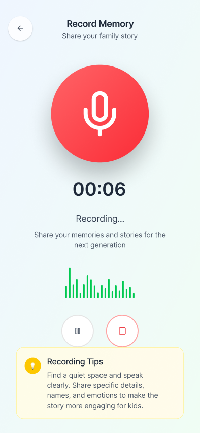
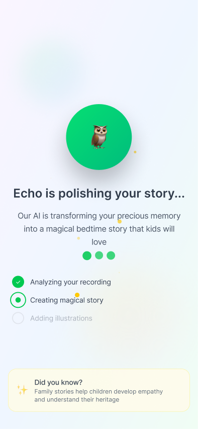

# 🎯 Echoes - Turn Conversations into Timeless Family Stories

[](https://flutter.dev)
[](https://fastapi.tiangolo.com)
[](https://github.com)

**🚀 ACTA Global Hackathon 2025 Submission**

> Preserving intergenerational knowledge by making it simple and delightful for grandparents to share life stories and for families to consume them as both archive posts and bedtime stories.

## 📱 App Preview

### Onboarding Experience
<div align="center">


</div>

### Main App Flow
<div align="center">



</div>

### Story Processing & Reading
<div align="center">


</div>

## 🌟 What is Echoes?

Echoes is an AI-powered mobile app that transforms grandparents' spoken memories into magical bedtime stories for children. Built with Flutter and powered by advanced AI technologies, it bridges generations through the timeless art of storytelling.

### ✨ Key Features

- **🎙️ Voice Recording**: Simple, accessible interface for grandparents to record their memories
- **🤖 AI Story Generation**: Uses Google Gemini to transform memories into engaging children's stories
- **📖 Interactive Story Reading**: Children's book-style carousel with page-by-page navigation
- **🔊 Text-to-Speech**: AI-generated narration brings stories to life
- **🎨 Gamified Experience**: Duolingo-inspired design with delightful animations and interactions

### 🎯 The Problem We Solve

Family stories and wisdom often get lost between generations. Echoes makes it effortless for grandparents to preserve their memories while creating magical content that children actually want to engage with.

### 👥 Who It's For

- **👴👵 Grandparents**: Easy, voice-first way to share life stories
- **👨‍👩‍👧‍👦 Parents**: Meaningful bedtime content derived from family history
- **👶 Children**: Magical, personalized stories about their family heritage

## 🛠️ Technology Stack

### Frontend (Flutter)
- **🎨 UI Framework**: Flutter with custom animations and transitions
- **🧭 Navigation**: GoRouter for seamless navigation flow
- **📱 State Management**: Provider pattern for reactive UI updates
- **🎵 Audio**: FlutterSound for recording and playback

### Backend (FastAPI)
- **🚀 API**: FastAPI with async/await for high performance
- **🎙️ Speech-to-Text**: Deepgram for accurate transcription
- **🤖 AI Story Generation**: Google Gemini for creative storytelling
- **🔊 Text-to-Speech**: Deepgram TTS for natural narration
- **☁️ Deployment**: Render.com for reliable cloud hosting

### AI & Processing
- **📝 STT**: Deepgram Nova-3 model for speech recognition
- **✍️ Story Generation**: Google Gemini 2.0 Flash for creative writing
- **🗣️ TTS**: Deepgram Aura voices for natural speech synthesis

## 🚀 Quick Start

### Prerequisites
- Flutter SDK (>=3.0.0)
- Python 3.8+
- Deepgram API Key
- Google Gemini API Key

### Frontend Setup
```bash
flutter pub get
flutter run
```

### Backend Setup
```bash
cd backend
pip install -r requirements.txt

# Create .env file with your API keys
echo "DEEPGRAM_API_KEY=your_key_here" > .env
echo "GOOGLE_GEMINI_API_KEY=your_key_here" >> .env

# Run the server
python main.py
```

## 🎬 How It Works

1. **📱 Record Memory**: Grandparent records a personal story or memory
2. **🤖 AI Processing**: 
   - Speech-to-Text converts audio to text
   - Google Gemini transforms memory into a children's story
   - Text-to-Speech creates narration audio
3. **📖 Story Experience**: Child enjoys the story in an interactive book format
4. **💝 Family Archive**: Stories are preserved for future generations

## 🏆 Hackathon Achievements

Built in 24 hours for the ACTA Global Hackathon 2025, focusing on:

- **🎨 Craft**: Polished Flutter UI with smooth animations and responsive design
- **💡 Novelty**: Unique combination of memory preservation and children's storytelling
- **🛠️ Utility**: Solves real problem of intergenerational knowledge transfer
- **✨ Taste**: Warm, playful design inspired by modern mobile apps

## 🔗 Live Demo

**Backend API**: [https://echoes-backend.onrender.com](https://echoes-backend.onrender.com)

API Documentation: [https://echoes-backend.onrender.com/docs](https://echoes-backend.onrender.com/docs)

## 📂 Project Structure

```
workspace/
├── lib/                    # Flutter source code
│   ├── main.dart          # App entry point
│   ├── screens/           # UI screens
│   ├── services/          # API and backend services
│   ├── providers/         # State management
│   └── models/            # Data models
├── backend/               # FastAPI backend
│   ├── main.py           # API server
│   ├── requirements.txt  # Python dependencies
│   └── .env              # Environment variables
├── demo/                 # App screenshots
└── README.md            # This file
```

## 🎯 Core Features

### 🎙️ Audio Recording
- Voice-first interface optimized for accessibility
- Real-time recording with visual feedback
- Support for various audio formats

### 🤖 AI Processing Pipeline
- **Speech-to-Text**: Deepgram Nova-3 for accurate transcription
- **Story Generation**: Google Gemini creates engaging children's stories
- **Text-to-Speech**: Natural narration with Deepgram Aura voices

### 📖 Story Experience
- Children's book-style page navigation
- Interactive carousel with smooth animations
- "Read Aloud" functionality with synchronized audio
- Family-friendly design and typography

### 🎨 Design Philosophy
- **Accessibility First**: Large buttons, clear contrast, voice-first design
- **Gamification**: Duolingo-inspired progress and engagement patterns
- **Warm & Playful**: Family-friendly colors and animations
- **Cross-generational**: Appeals to both grandparents and children

## 📱 Installation & Setup

### Development Environment
1. **Install Flutter**: Follow the [official Flutter installation guide](https://docs.flutter.dev/get-started/install)
2. **Clone Repository**: `git clone <repository-url>`
3. **Install Dependencies**: `flutter pub get`
4. **Run App**: `flutter run`

### Backend Configuration
1. **Python Environment**: Create virtual environment with Python 3.8+
2. **Install Dependencies**: `pip install -r backend/requirements.txt`
3. **Environment Variables**: Set up `.env` file with API keys
4. **Start Server**: `python backend/main.py`

## 🔧 Configuration

### Required API Keys
- **Deepgram API Key**: For speech-to-text and text-to-speech
- **Google Gemini API Key**: For AI story generation

### Environment Setup
Create `backend/.env` file:
```env
DEEPGRAM_API_KEY=your_deepgram_api_key
GOOGLE_GEMINI_API_KEY=your_google_gemini_api_key
```

## 🎬 Demo Video

*Record a 60-second demo showing the complete user journey from recording a memory to reading the generated story.*

## 🚀 Deployment

### Backend Deployment (Render.com)
- Live API: [https://echoes-backend.onrender.com](https://echoes-backend.onrender.com)
- Interactive docs: [/docs](https://echoes-backend.onrender.com/docs)

### Mobile App
- Flutter APK available for Android
- iOS build ready for TestFlight distribution

## 🔮 Future Enhancements

- **User Accounts**: Personal story libraries with cloud sync
- **Story Sharing**: Share stories within family networks
- **Multiple Languages**: Support for various languages and accents
- **Advanced AI**: More sophisticated story generation and personalization
- **Family Trees**: Visual family history integration

---

**Built with ❤️ in 24 hours for ACTA Global Hackathon 2025**

*Echoes - Where family memories become magical bedtime stories*
